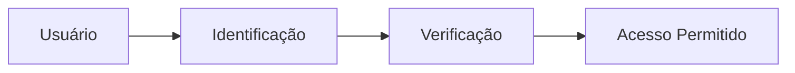
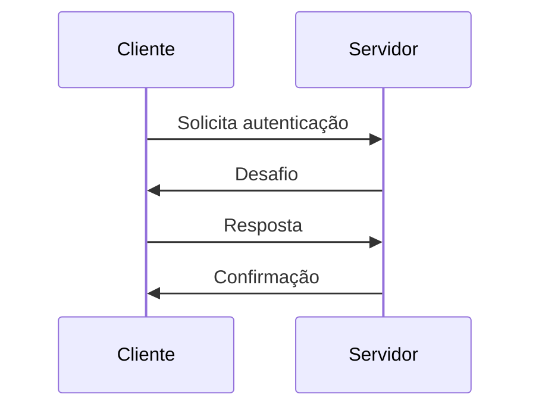
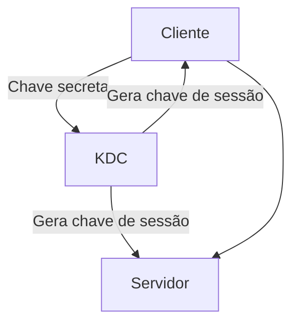
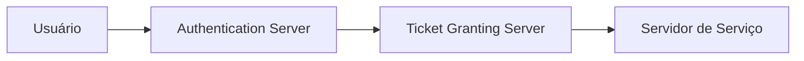
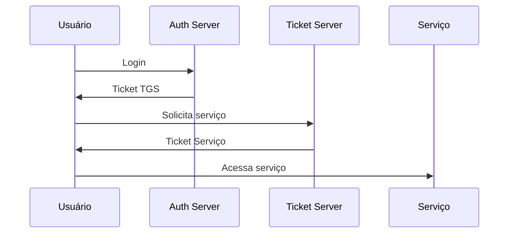
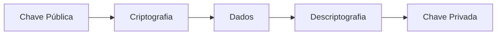
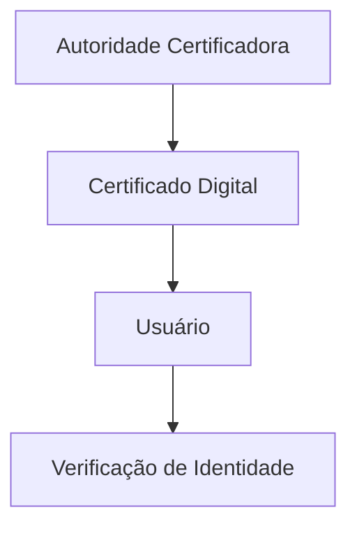

# 🔐 Autenticação e Kerberos 
  

> 📘 Resumo gerado com auxílio de IA do capítulo 15 (autenticação) e revisado.
- [Capítulo 15 do livro Stallings](https://mehranmisaghi.github.io/cybersecurity/materiais/cap15-stallings.pdf)

---

## 🔐 Conceitos Fundamentais

### 🧩 Etapas da Autenticação

---

### 🔑 Fatores de Autenticação

| Tipo | Exemplo |
|------|--------|
| 🧠 Algo que tem conhecimento | Senha, PIN |
| 📱 Dispositivo | Token, Cartão |
| 👤 Característica física | Biometria |
| ⌨️ Padrão de comportamento | Padrão de digitação |

---

## 🔄 Autenticação Mútua & Segurança

### 🤝 Autenticação Mútua

---

### ⚠️ Principais Ataques

- 🔁 Replay Attack (repetição)
- 🎭 Personificação
- 📡 Interceptação

### 🛡️ Proteções

- Timestamp ⏱️  
- Nonce 🔢  
- Desafio-resposta 🔐  

---

## 🔑 Criptografia Simétrica

### ✔️ Características:
- Uso de chave compartilhada
- Alto desempenho

### ❌ Desvantagens:
- Distribuição de chaves complexa
- Vulnerável a replay

---

## 📧 Autenticação em Sistemas Assíncronos

- Comunicação não simultânea (ex: e-mail)
- Uso de criptografia para garantir:
  - Confidencialidade
  - Autenticidade

---

## 🛡️ Kerberos

### 📌 Visão Geral

Sistema de autenticação centralizado baseado em criptografia simétrica.

---

### 🧠 Arquitetura

---

### 🔄 Funcionamento

---

### ✅ Vantagens

- 🔐 Senhas não trafegam na rede
- 🔁 Single Sign-On (SSO)
- 🏢 Centralização da autenticação

### ❌ Limitações

- Dependência do servidor Kerberos
- Sincronização de tempo necessária

---

## 🔐 Criptografia Assimétrica

### ✔️ Benefícios:
- Segurança elevada
- Não requer compartilhamento prévio de chave

---

## 🌐 Identidade Federada

> 🔗 Um único login para múltiplos sistemas

### Exemplos:
- Google
- Facebook
- Microsoft

### ✔️ Vantagens:
- Melhor experiência do usuário
- Menos senhas

---

## 🧾 PKI (Infraestrutura de Chaves Públicas)

### Componentes:
- Certificados digitais
- Assinaturas digitais
- Autoridades certificadoras
---
##  [Slides da Aula - Criptografia (III)](https://canva.link/3imxx00leivyomj)

## [Voltar para Criptografia](README.md)