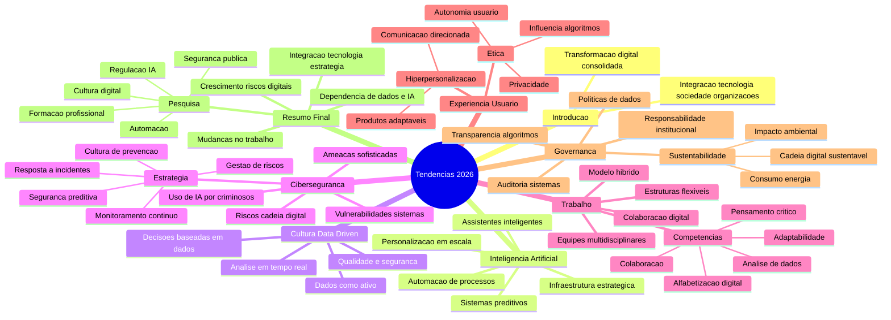

## Tendências em 2026: Transformações Tecnológicas, Sociais e Organizacionais

Como foi comentado na [Introdução de segurança](intro.md), estamos vivenciando uma forte integração entre tecnologia, mudanças organizacionais e novos comportamentos sociais.

---
### Inteligência Artificial como Infraestrutura Estratégica

Uma das mudanças mais significativas é a consolidação da Inteligência Artificial (IA) como parte essencial das organizações — não apenas como diferencial competitivo, mas como base estrutural.

_Da experimentação à integração sistêmica_

A IA passa a fazer parte do dia a dia organizacional. Isso inclui:

- Automação de processos complexos
- Sistemas preditivos baseados em grandes volumes de dados
- Personalização em larga escala
- Assistentes inteligentes integrados às rotinas
---
### Cultura Data-Driven e Tomada de Decisão Baseada em Evidências

 _Dados como ativo estratégico_

- Coletar diferentes tipos de dados
- Garantir qualidade e segurança das informações
- Transformar dados em decisões práticas
- Utilizar análises em tempo real
---
### Cibersegurança e Gestão de Riscos Digitais

_Complexificação das ameaças_

- Ataques cibernéticos mais sofisticados
- Uso de IA por criminosos digitais
- Riscos em cadeias de suprimento digitais
- Vulnerabilidades em sistemas interconectados
---
### Transformações no Trabalho e nas Competências

_Novos modelos organizacionais_

- Consolidação do trabalho híbrido
- Estruturas menos hierárquicas
- Equipes multidisciplinares
- Colaboração mediada por tecnologia
- A flexibilidade passa a ser parte da estrutura organizacional.

_Reconfiguração das competências_
- Pensamento crítico
- Adaptabilidade
- Alfabetização digital
- Capacidade analítica
- Colaboração interdisciplinar
---
### Experiência do Usuário

_Hiperpersonalização_
- Experiências personalizadas
- Comunicação direcionada
- Produtos adaptáveis em tempo real

_Questões éticas_

- A autonomia do usuário está sendo preservada?
- Como equilibrar eficiência e privacidade?
- Até onde vai a influência dos algoritmos?
---
### Governança, Sustentabilidade e Responsabilidade Digital

- Transparência nos algoritmos
- Políticas claras de uso de dados
- Auditoria de sistemas automatizados
- Responsabilização institucional

_Sustentabilidade digital_

- Impacto ambiental da tecnologia
- Consumo energético de data centers
- Sustentabilidade nas cadeias digitais

_Oportunidades de Pesquisa_

- Impactos da automação
- Regulação da IA
- Cultura organizacional digital
- Segurança como política pública
- **Formação profissional**
---
## Um panorama geral das tendências

### Você quer trabalhar na área de cibersegurança na era de IA?

- [Meu artigo no linkedin](https://www.linkedin.com/posts/mehranmisaghi_mente-artificial-ep-30-ia-ciberseguranca-share-7435689227654172672-F7Ir/?utm_source=share&utm_medium=member_desktop&rcm=ACoAAAFr4hwBj8IIIfdQXgZ87nD1v4n1v-F79PA)
- [Entrevista no canal Mente Artifical](https://youtu.be/FoD440khpp8?si=ncOkThq-ruuNBMPn)
