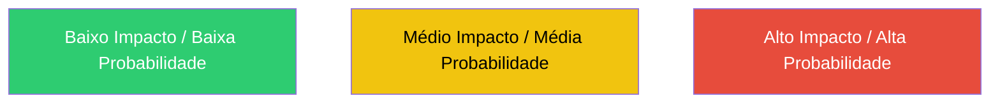
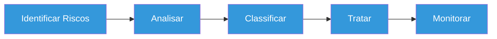
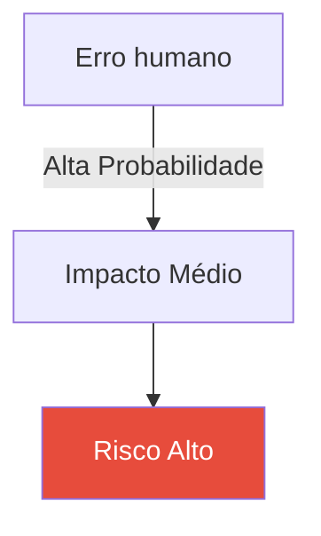

# 📘 Aula: Gestão de Riscos, Contingência e Continuidade

## 🎯 Objetivo da aula
Ao final, o aluno será capaz de:
- Identificar riscos  
- Classificar impacto e probabilidade  
- Montar uma tabela de riscos  
- Entender contingência e continuidade  

---

# 🧠 1. O que é RISCO?

> Risco é a chance de algo dar errado e causar prejuízo.

### 📌 Exemplos:
- Sistema cair  
- Vazamento de dados  
- Falta de energia  
- Erro humano  

---

# ⚠️ 2. Componentes do risco

- **Ameaça** → o que pode acontecer  
- **Vulnerabilidade** → fraqueza  
- **Impacto** → consequência  

### Exemplo:
- Ameaça: hacker  
- Vulnerabilidade: senha fraca  
- Impacto: roubo de dados  

---

# 📊 3. Probabilidade x Impacto

- Probabilidade: Baixa / Média / Alta  
- Impacto: Baixo / Médio / Alto  

---

# 📋 4. Tabela de Riscos

| ID | Risco | Probabilidade | Impacto | Nível | Ação |
|----|------|-------------|--------|------|------|
| 1 | Falta de energia | Média | Alto | Alto | Gerador |
| 2 | Ataque hacker | Baixa | Alto | Médio | Firewall |
| 3 | Erro humano | Alta | Médio | Alto | Treinamento |
| 4 | Perda de dados | Média | Alto | Alto | Backup |

---

## 🧮 Cálculo do risco
Nível de Risco = Probabilidade x Impacto

---

# 📊 5. Matriz de Risco

# 🛡️ 6. Tratamento de Riscos

| Estratégia | Descrição |
|----------|----------|
| Evitar | eliminar o risco |
| Reduzir | diminuir impacto ou probabilidade |
| Transferir | passar para terceiros (ex: seguro) |
| Aceitar | assumir o risco |

---

# 🚨 7. Plano de Contingência

> Plano para agir quando o problema acontece.

## 📌 Exemplos:
- Sistema caiu → usar servidor reserva  
- Falta de energia → usar gerador  
- Ataque hacker → isolar sistema  

---

# 🔄 8. Plano de Continuidade

> Plano para manter o negócio funcionando mesmo durante falhas.

| Contingência | Continuidade |
|------------|------------|
| Reação ao problema | Manutenção do serviço |
| Curto prazo | Longo prazo |
| Emergencial | Estratégico |

---

# 🔁 9. Fluxo de Gestão de Riscos

# 🧪 10. Atividade Prática

## 💡 Cenário:
Uma escola depende de um sistema online para funcionar.

## 🎯 Tarefas dos alunos:
1. Identificar 5 riscos  
2. Criar uma tabela de riscos  
3. Definir ações de mitigação  
4. Criar um plano de contingência  

---

## 📄 Modelo para preenchimento:

| Risco | Probabilidade | Impacto | Ação |
|------|-------------|--------|------|
| | | | |

---

# 🎤 11. Perguntas para discussão

- Qual risco é mais perigoso?  
- Todo risco deve ser eliminado?  
- O que é mais importante: prevenir ou reagir?  

---

# 🧠 12. Resumo

- Risco = problema possível  
- Tratamento = estratégia  
- Contingência = reação  
- Continuidade = manter funcionamento  

---

# 🚀 13. Exemplo de Classificação Visual

