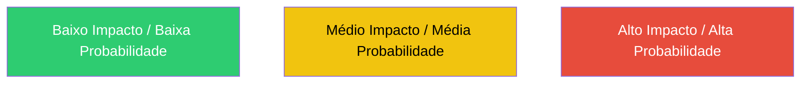
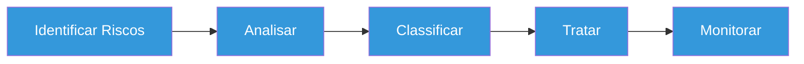
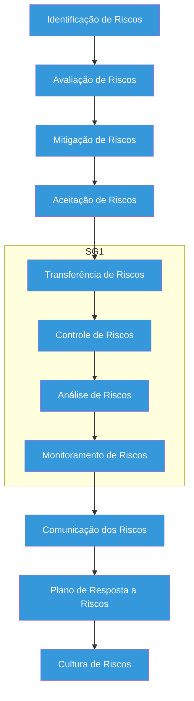

> Este material foi preparado com auxílio de IA e revisado.
--- 

# O que é Risco?

> Risco pode ser definido como a chance de algo dar errado e causar prejuízo.

### Alguns exemplos de risco:
- Indisponibilidade de um sistema.  
- Vazamento de dados.  
- Falta de energia.  
- Erro humano.  

---

# Componentes do Risco

- **Ameaça** → o que pode acontecer?  
- **Vulnerabilidade** → fraqueza a ser explorada  
- **Impacto** → consequência de materialização/concretização do risco 

### Exemplo de compoentnes de Risco:
- Ameaça: hacker  
- Vulnerabilidade: senha fraca  
- Impacto: roubo de dados  

---

# Probabilidade x Impacto

- Probabilidade: Baixa / Média / Alta  
- Impacto: Baixo / Médio / Alto  

---

# Tabela de Riscos

| ID | Risco | Probabilidade | Impacto | Nível | Ação |
|----|------|-------------|--------|------|------|
| 1 | Falta de energia | Média | Alto | Alto | Gerador |
| 2 | Ataque hacker | Baixa | Alto | Médio | Firewall |
| 3 | Erro humano | Alta | Médio | Alto | Treinamento |
| 4 | Perda de dados | Média | Alto | Alto | Backup |

---

## Como calcular o risco?
Para calcular o risco:

> _Nível de Risco = Probabilidade x Impacto_

---

# Matriz de Risco

---

# Plano de Contingência

> É um plano para agir quando o problema acontece.

## Exemplos:
- Sistema caiu → usar servidor reserva  
- Falta de energia → usar gerador  
- Ataque hacker → isolar sistema  

---

# Plano de Continuidade

> É um plano para manter o negócio funcionando mesmo durante falhas.

| Contingência | Continuidade |
|------------|------------|
| Reação ao problema | Manutenção do serviço |
| Curto prazo | Médio/Longo prazo |
| Emergencial | Estratégico |

---
# Contingêndia X Continuidade
---
# Fluxo de Gestão de Riscos

## Etapas mais detalhadas para Gestão de Riscos

1. Identificação de Riscos
2. Avaliação de Riscos
3. Mitigação de Riscos
4. Aceitação de Riscos
5. Transferência dos Riscos
6. Controle dos Riscos
7. Análise dos Riscos
8. Monitoramento dos Riscos
9. Comunicação dos Riscos
10. Plano de Resposta a Riscos
11. Cultura de Riscos

# Vamos praticar?

## Vamos praticar isto numa escola que utiliza um sistema online para funcionar:

### O que deve ser feito?
1. Identificar 5 riscos  
2. Criar uma tabela de riscos  
3. Definir ações de mitigação  
4. Criar um plano de contingência  

---

### Modelo sugerido:

| Risco | Probabilidade | Impacto | Ação |
|------|-------------|--------|------|
| | | | |

---

## Resumo

- Risco = problema possível  
- Contingência = reação  
- Continuidade = manter funcionamento  

---
# Materiais para esta aula

 - [Slides da aula](https://canva.link/cvq0o0rn53aif4n)

 - [Teste os seus conhecimentos sobre Gestão de Riscos](https://mehranmisaghi.github.io/cybersecurity/Risks/riscos.html)
