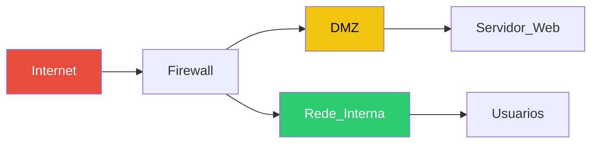
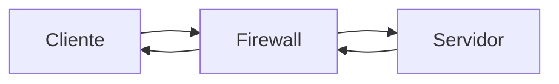
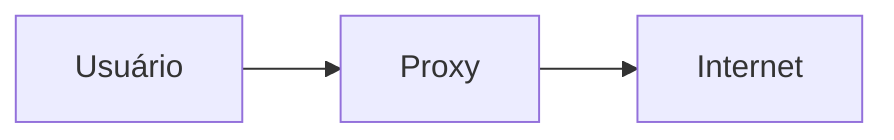
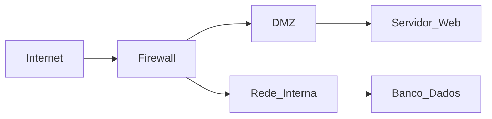

> Este material foi gerado com auxílio de **IA** e foi revisado.
# O que é Firewall?

Firewall pode ser definido como um sistema de segurança que controla o tráfego de rede, **permitindo ou bloqueando** conexões com base em _regras estabelecidas_.

---

# Arquitetura de Rede com Firewall



---

# Relação com o Modelo OSI

| Tipo de Firewall | Camada OSI |
|----------------|----------|
| Packet Filtering | Camada 3 |
| Stateful | Camada 3 e 4 |
| Proxy | Camada 7 |
| NGFW | Multicamadas |

---

# Tipos de Firewall

## Packet Filtering Firewall
- Analisa IP, porta e protocolo utilizado
- Não mantém estado (stateless)

Exemplo:
```bash
iptables -A INPUT -p tcp --dport 80 -j ACCEPT
```

---

## Stateful Firewall
- Mantém estado das conexões  
- Permite apenas conexões válidas  



---

## Proxy Firewall
- Atua como intermediário  
- Analisa conteúdo da aplicação  



---

## NGFW (Next Generation Firewall)
- Inspeção profunda (DPI)  
- IDS/IPS  
- Controle de aplicações  

---

## Outros
- Instalado no computador  

---

# Comparativo entre os tipos

| Tipo | Camada | Segurança | Complexidade |
|------|--------|----------|-------------|
| Packet | 3 | Baixa | Baixa |
| Stateful | 3/4 | Média | Média |
| Proxy | 7 | Alta | Alta |
| NGFW | Multicamadas | Muito alta | Alta |

---

# Exemplo de Regras de Firewall

| Ação | Origem | Destino | Porta | Protocolo |
|------|-------|--------|------|----------|
| Allow | Any | Server | XX | TCP |
| Deny | Any | Any | XX | TCP |

> **Tudo que não é permitido deve ser bloqueado**

---

# DMZ (Zona Desmilitarizada)

>DMZ  pode ser definida como uma área da rede que fica entre a Internet e a rede interna, usada para hospedar serviços que precisam ser acessados externamente sem expor a rede principal. A DMZ funciona como se fosse uma “zona de isolamento”, sendo que se algo for atacado ali, o invasor não consegue acessar a rede interna. DMZ Protege a rede interna, permite isolar ataques e fornece um controle sobre acesso externo.



---
## O que fica normalmente no DMZ?
- Servidor web 
- Servidor de e-mail
- DNS
- Outros serviços?
---

# Limitações de Firewall

Firewall NÃO protege contra:
- Engenharia social  
- Senhas fracas  
- Ataques internos  
- Malware via dispositivos externos  

---

# ALguns comandos práticos para utilizar no linux (iptables)


Bloquear IP:
```bash
iptables -A INPUT -s 192.168.1.100 -j DROP
```

Permitir HTTP:
```bash
iptables -A INPUT -p tcp --dport 80 -j ACCEPT
```

Bloquear Telnet:
```bash
iptables -A INPUT -p tcp --dport 23 -j DROP
```

Limpar regras:
```bash
iptables -F
```
---
