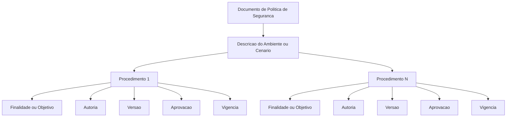
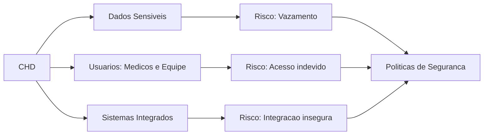
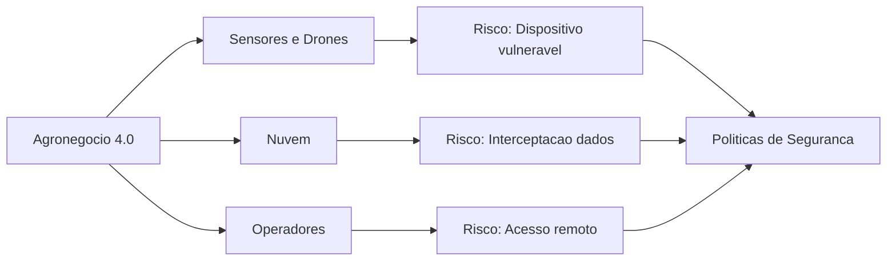
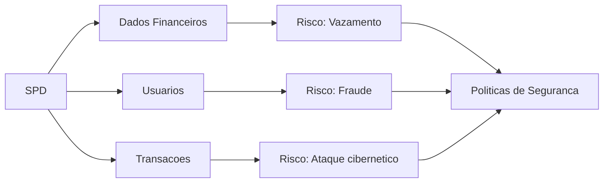
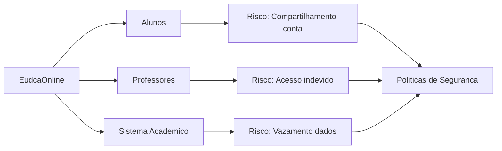
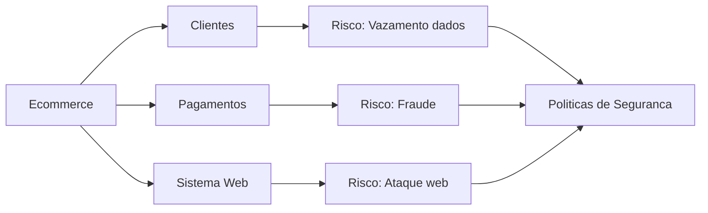
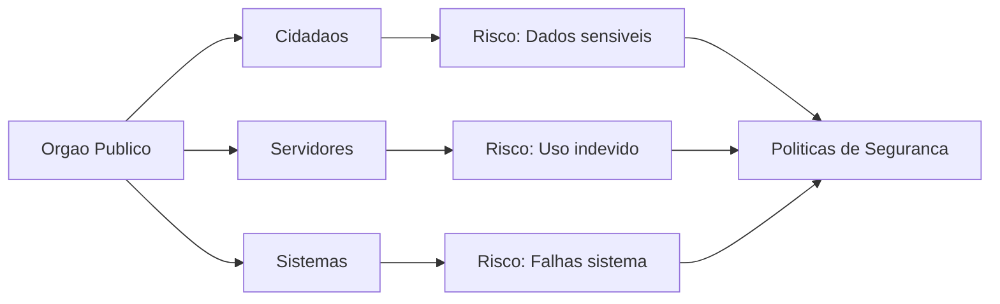
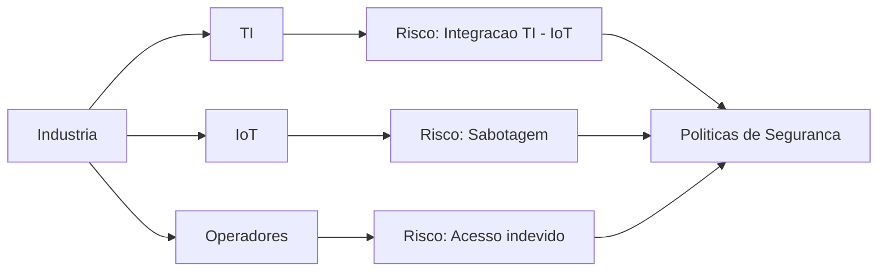

# Projeto de Segurança II (PSII) (01/06)
> Elaborar políticas de segurança da informação com as particulidades de cada cenário
- Cada grupo deve escolher um cenário.
- Elaborar políticas necessárias: 
    - Não esquecer de tratar o que acontecerá no caso de violação da política (penalidades). L
    - Lembrando que para aplicação de penalidade, o funcionário deve ter ciência da política. Para esta finalidade, empresa deve utilizar meios adequeados para divulgação de procedimentos adotados.
- O seu documento (política) ter:
    - Uma descrição do ambiente/cenário escolhido
    - Para cada procedimento:
        - Finalidade ou objetivo 
        - Autoria (nome da pessoa ou setor e data)
        - Versão (Versão em vigor. Por esemplo Versão 1.3)
        - Aprovação (nome e data)
        - Vigência (a partir de que data, e quando expira)
- **Enviar/compartilhar as políticas até dia 12/06.**
- **Preparar uma apresentação, comentando o que cada membro fez.**
- **Apresentar nos dias 15 e 16 de junho.**
- Para melhor entedimento, revise 
    - Os conceitos de [Gestão de Riscos](griscos.md)
    - Os conceitos de [Poítica de Segurança e Política de Privacidade](politica.md)

# Fluxo de Documento da Política
> Segue o fluxo sugerido. Podem acrescentar, caso haja necessidade.

---
## 1. Centro Hospitalar Digital (CHD) (Luiza, Maria Fernanda e Pedro)
É um centro hospitalar que possui prontuário eletrônico integrado com os laboratório e acesso remoto por médicos.

Elabore uma política para abordar:

- Controle de acesso por perfil (médico, enfermeiro(a), administrativo)
- Armazenamento seguro de dados sensíveis (especificar tipo de criptografia)
- Descarte digital de prontuários antigos
- Política de troca de senha obrigatória
- Restrição total de uso de redes sociais em áreas críticas
- Restrição parcial de uso de redes sociais em outras áreas

Não esqueça de tratar:

- Vazamento de dados de pacientes
- Acesso indevido por funcionários
- Uso de redes sociais em ambiente clínico

---
## 2. Agronegócio 4.0 (Fábio, José e Otávio)
É uma fazenda inteligente com sensores e drones.

Elabore uma política para abordar:

- Controle de acesso a dispositivos e sistemas
- Armazenamento de dados agrícolas na nuvem (especificar o tipo de criptografia)
- Descarte de dados históricos e backups
- Política de senhas para dispositivos IoT
- Uso de redes sociais por operadores em campo

Não esqueça de tratar:

- Dispositivos IoT vulneráveis
- Dados de produção expostos
- Acesso remoto inseguro

---
 ## 3. Sistema de Pagamento Digital (SPD) (Gustavo, Maria Eduarda e Rafael)
É ume empresa que processa pagamentos e dados financeiros de clientes.

Elabore uma política para abordar:

- Controle de acesso com autenticação MFA
- Armazenamento seguro (criptografia de dados financeiros - indicar tipo utilizado)
- Descarte seguro de logs e dados sensíveis
- Política de escolha/troca de senha (alta criticidade)
- Uso controlado de redes sociais por funcionários

Não esqueça de abordar:

- Fraudes
- Vazamento de dados financeiros
- Engenharia social via redes sociais

---
## 4. EducaOnline (Camila, Gabriela e Sidiclei)
É uma instituição de ensino com cursos online, permitinado acesso online aos seus cursos.

Elaborae uma política para abordar:

- Controle de acesso de alunos e professores (MFA)
- Armazenamento de dados acadêmicos (criptografia - especificar)
- Descarte de dados de ex-alunos
- Política de troca de senha
- Uso de redes sociais dentro da rede institucional

Não esquecer de tratar:
- Compartilhamento indevido de contas
- Vazamento de dados acadêmicos
- Uso indevido da internet

---
## 5. Sistema de e-commerce (Sidnei, Gabriel Lopes e Luiz)
É uma Loja online com dados pessoais e histórico de compras.

Elaborar uma política para tratar:

- Controle de acesso ao sistema administrativo(MFA)
- Armazenamento seguro de dados de clientes (criptografia - especificar)
- Descarte de dados obsoletos
- Política de senha
- Uso de redes sociais para atendimento ao cliente

Não esquecer de tratar:
- Vazamento de dados
- Manipulação de informações

---
## 6. Órgão Público (Ana, Henrique e Sara)
É uma instituição governamental com dados de cidadãos.

Elaborar uma política para tatar:

- Controle de acesso por nível hierárquico
- Armazenamento de dados sensíveis (criptografia - especificar)
- Descarte digital conforme legislação
- Política de troca de senha obrigatória
- Uso de redes sociais por servidores públicos

Não esqueça de tratar:

- Vazamento de informações
- Baixa cultura de segurança
- Uso indevido de sistemas

---
## 7. Uma indústria de tubos (Stephane, Alexssandro e João) (Gabriel Gomes, Ricardo e Paulo)
É uma fábrica com sistemas industriais conectados à internet.

Elaborar umapolítica que inclua:

- Controle de acesso físico e lógico (segmentado por setor)
- Armazenamento de dados industriais (criptografia - especificar)
- Descarte de logs operacionais
- Política de senha para operadores
- Uso restrito de redes sociais em áreas operacionais

Não esqueça de tatar:

- Acesso indevido à produção
- Risco de sabotagem
- Integração TI x IoT

---
## Artefatos esperados:
- Entregar o documento de política citando as partes de cada norma utilizada.
- Entregar a tabela de riscos preenchida
- Elaborar uma apresentação
- Apresentar a política elaborada.

## Grupos de Trabalho(Apresentações no dia 15 e 16 de junho)
1. Luiza, Maria Fernanda e Pedro (CHD)
2. Fábio, José e Otávio (Agronegócio)
3. Gustavo, Maria Eduarda e Rafael (SPD)
4. Camila, Gabriela e Sidiclei (EducaOnline)
5. Sidnei, Gabriel Lopes e Luiz (e-commerce)
6. Ana, Henrique e Sara (Órgão Público)
7. (Stephane, Alexssandro e João)(Gabriel Gomes, Ricardo e Paulo) (Indústria de tubos)
---
## Ordem das Apresentações (15 e 16 de junho)
1. 
2. 
3. 
4. 
5. 
6. 
7. 
---
