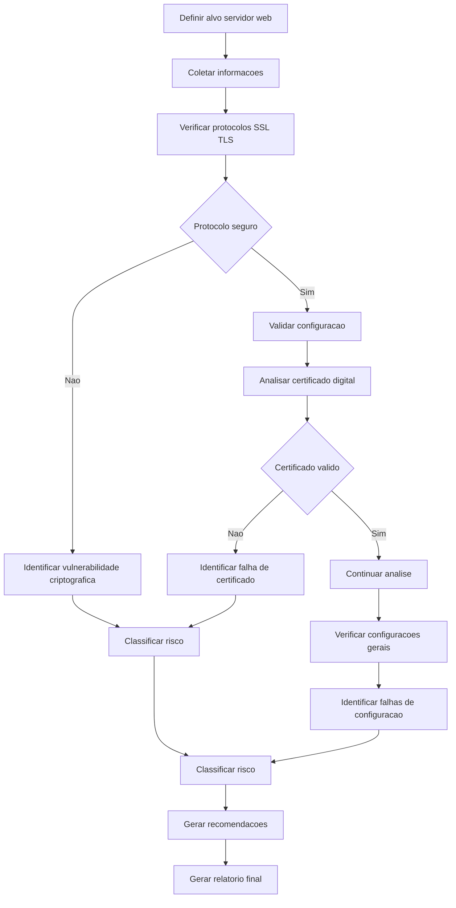
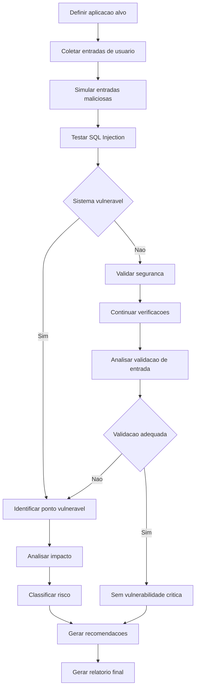
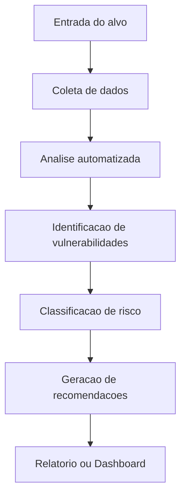

# Projeto de Segurança III: Automação de Diagnóstico de Vulnerabilidades com IA

---

## Objetivo

Desenvolver uma ferramenta automatizada utilizando agentes de IA (como n8n ou similares) capaz de realizar diagnóstico de vulnerabilidades, identificando riscos e sugerindo ações corretivas.

---

## Descrição

A solução deve:

- Coletar informações do sistema alvo  
- Identificar vulnerabilidades  
- Classificar riscos  
- Sugerir medidas de mitigação  

A ferramenta deve operar de forma automatizada, simulando um processo de auditoria de segurança.

---

## Cenários Disponíveis

Escolher **um dos cenários abaixo**:

---

### Cenário 1 – Servidor Web

A ferramenta deve:

- Analisar protocolos criptográficos (SSL/TLS)  
- Identificar configurações inseguras  
- Avaliar certificados digitais  
- Detectar falhas de configuração  

#### Saídas esperadas:
- Lista de vulnerabilidades  
- Classificação de risco  
- Recomendações de correção  

---

### Cenário 2 – Banco de Dados via Web

A ferramenta deve:

- Identificar vulnerabilidades de SQL Injection  
- Simular entradas maliciosas  
- Detectar falhas de validação  
- Avaliar exposição de dados  

#### Saídas esperadas:
- Pontos vulneráveis  
- Classificação de risco  
- Recomendações de mitigação  

---

## Requisitos Técnicos

- Utilizar ferramenta de automação (ex: n8n)  
- Integrar fluxo de coleta, análise e resposta  
- Implementar lógica automatizada  
- Gerar saída em relatório ou dashboard  

---

## Requisitos de Segurança

- Seguir boas práticas de segurança  
- Não executar testes destrutivos  
- Utilizar ambiente controlado  

---

## Artefatos esperados

### Documentção
- Objetivo  
- Arquitetura  
- Tecnologias  

### Fluxo
- Diagrama do processo  

### Sistema
- Protótipo funcional  

### Relatório
- Vulnerabilidades  
- Riscos  
- Recomendações  

---

## Fluxo sugerido da solução

