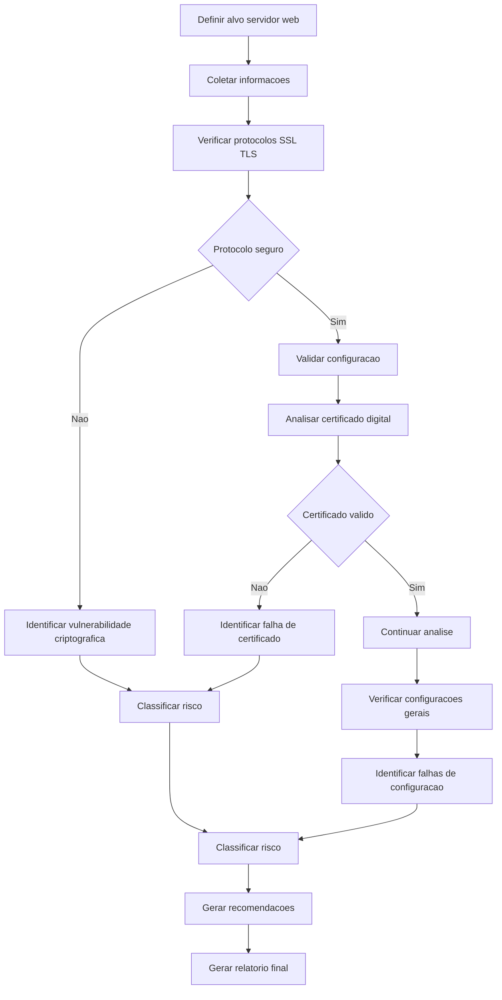
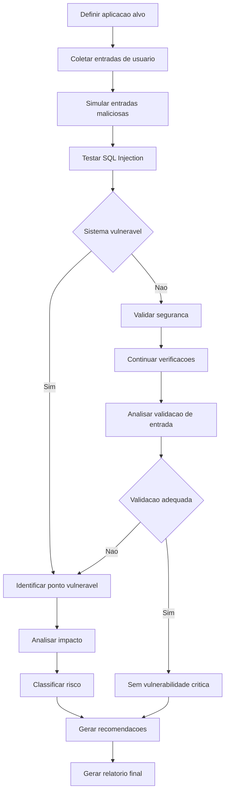
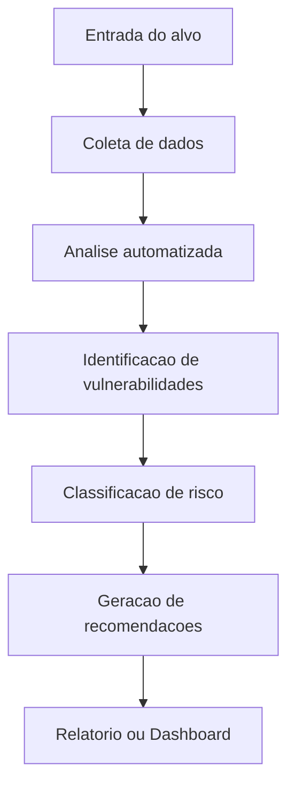

# Projeto de Segurança III: Automação de Diagnóstico de Vulnerabilidades com IA (22/06)
---
## Objetivo

>Desenvolver uma ferramenta automatizada utilizando agentes de IA (como n8n ou similares) capaz de realizar diagnóstico de vulnerabilidades, identificando riscos e sugerindo ações corretivas.

---
- Cada grupo (até 3 pessoas) deve escolher um cenário.
- Estar atento aos artefatos solicitados:
    - Não esquecer de requistos técnicos de cada cenário
- Caso tenha utilizado IA:
    - Qual IA?
    - Prompt(s) utilizado
- Agendar apresentação da ferramenta (para professor):
    - Dias 29 a 2 de julho.
---
## Descrição

A ferramenta desenvolvida deve:

- Coletar informações do sistema alvo  
- Identificar vulnerabilidades  
- Classificar e apresentar riscos  
- Sugerir medidas e ações correctivas

A ferramenta deve operar de forma automatizada, simulando um processo de auditoria de segurança.
---

## Cenários Disponíveis

### Cenário 1 – Servidor Web

A ferramenta deve:

- Analisar protocolos criptográficos (SSL/TLS)  
- Identificar configurações inseguras  
- Avaliar certificados digitais  
- Detectar falhas de configuração  

#### Saídas esperadas:
- Lista de vulnerabilidades  
- Classificação de risco  
- Recomendações de correção  

---

### Cenário 2 – Banco de Dados via Web

A ferramenta deve:

- Identificar vulnerabilidades de SQL Injection  
- Simular entradas maliciosas  
- Detectar falhas de validação  
- Avaliar exposição de dados  

#### Saídas esperadas:
- Pontos vulneráveis  
- Classificação de risco  
- Recomendações de mitigação  

---

## Requisitos Técnicos

- Utilizar ferramenta de automação (ex: n8n)  
- Integrar fluxo de coleta, análise e resposta  
- Implementar lógica automatizada  
- Gerar saída em relatório ou dashboard  

---

## Requisitos de Segurança

- Seguir boas práticas de segurança  
- Não executar testes destrutivos  
- Utilizar ambiente controlado  

---

## Artefatos esperados

### Documentção
- Objetivo  
- Arquitetura  
- Tecnologias  

### Fluxo
- Diagrama do processo  

### Sistema
- Protótipo funcional  

### Relatório
- Vulnerabilidades  
- Riscos  
- Recomendações  

---

## Fluxo sugerido da solução

---
## Grupos de Trabalho
1. Maria Fernanda e Pedro (Cenário 1)
2. Sidnei, Gabriel [Alves, Lopes] e Luiz (Cenário 1)
3. Camila, Gabriela e Sidiclei (Cenário 1)
4. Ana, Henrique e Sara (Cenário 1)
5. Paulo, Gabriel Gomes e Ricardo
6. Gustavo, Maria Eduardo e Rafael
7. Fábio, José e Otávio
---
## Apresentações e link de Trabalhos
| Data | Horário | Grupo      |
|------|---------|-------------|
|26/06|8h30|[Maria Fernanda e Pedro](https://github.com/mariaacaetano/Verificador/tree/main)
|26/06|10h00|[Paulo, Gabriel Gomes e Ricardo](https://github.com/paulorolinski/ciberseguranca-PSIII)
|01/07 |9h15 |Ana, Henrique e Sara | 
|01/07 |10h00 |Fábio, José e Otávio | 
---
## Agendamento e realização das apresentações
 - Poderão agendar até dia 02 de julho para apresentar.
 - As apresentações poderão ser presenciais ou remotas.
 - Marque a sua apresentação na [minha agenda](https://calendar.app.google/L1uq7QfhzMSMurQT7)
 ---

