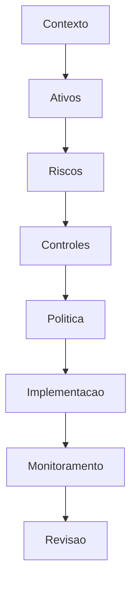
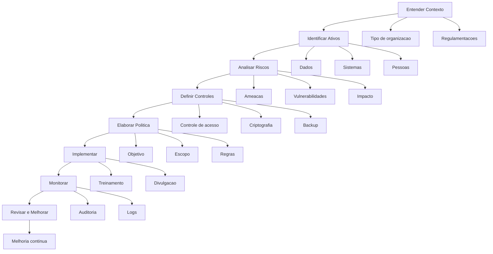

#  Política de Segurança da Informação e Política de Privacidade da Informação

---

## O que é Política de Segurança da Informação?

A Política de Segurança da Informação pode ser definido como um conjunto de procedimentos que definem como uma organização protege seus ativos de informação. Esta política tem por objetivo assegurar confidencialidade, integridade e disponibilidade.

### Exemplos de Políticas de Segurança da Informação:
- Controle de acesso
- Uso de senhas
- Backup de dados
- Uso de redes sociais

---

## O que é Política de Privacidade da Informação

A Política de Privacidade define como os dados pessoais são (tendo em foco a proteção de dados pessoais, transparência e direitos do titular):

- Coletados
- Utilizados
- Armazenados
- Compartilhados
- Protegidos

---

## Gestão de Riscos
Risco é a possibilidade de um evento causar impacto negativo à organização. [Para melhor entendimento veja novamente os conceitos de riscos](griscos.md)

---

## Etapas de Elaboração de Políticas

## Etapas detalhadas

---
## [Projeto de Segurança II](PSII.md)